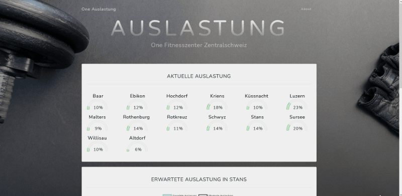

# Data collection and analysis of fitness centre occupancy

This project collects the centre occupancy of all [One Fitness Centres](https://one-training.ch/) and analyses the centre occupancy depending on daytime.

# Project website
The project runs on a Linux server that is hosted by Linode.

[Project website](https://patrickstaehli.ch/one_occupancy)

# Scraper
The current occupancy is requested every 15 minutes from the url: `https://blfa-api.migros.ch/fp/api/center/<center_id>/currentuser/`.
This data is then inserted to an SQLite database.

## Installing for Development
Install the packages according to the `scraper/reqirements.txt`.

# Webapp
The flask app visualizes the current and the daytime dependent centre occupancy.

## Installing for Development
Install the packages according to the `scraper/reqirements.txt`.
